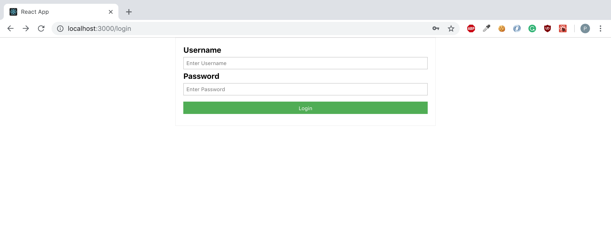
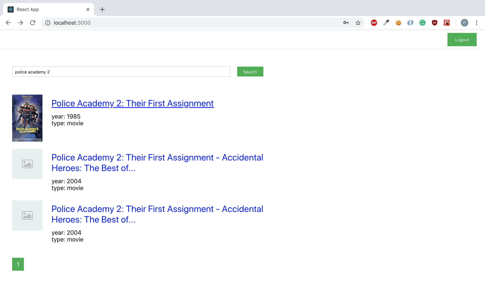
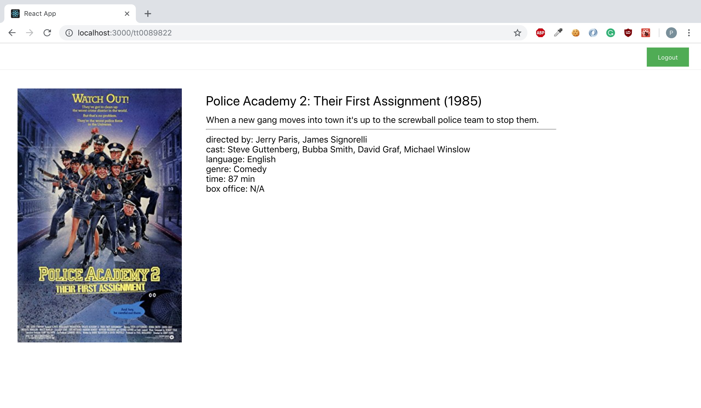

### Django and React application for browsing movie database

To run use `docker-compose`
```
> git clone https://github.com/zyks/movie-db.git
> cd movie-db/
> docker-compose build
> docker-compose up
```
then go to the `localhost:3000/` URL in your browser.

Default user credentials are:
```
username: testuser
password: user1234
```

### Screenshots
<p align="center">
 
</p>

<p align="center">
 
</p>

<p align="center">
 
</p>
